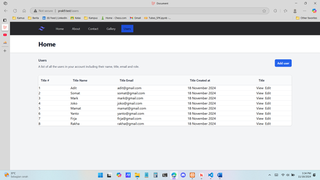
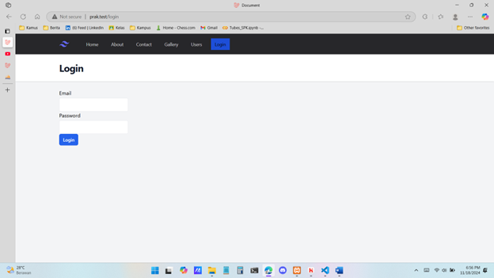

### Tugas 10

### Hasil Output

### Laravel 11/13 Update dan Refactor

### Laravel 11/14 Handle Request

### Laravel 11/15 Delete

### Laravel 11/16 Route Resource

### Laravel 11/17 Authenticate User

### Laravel 11/18 Laravel Breeze

## Kontribusi

Dibuat oleh Firja Rakha Adwittya.

## Lisensi

Projek ini dilisensikan di bawah [MIT License](LICENSE).