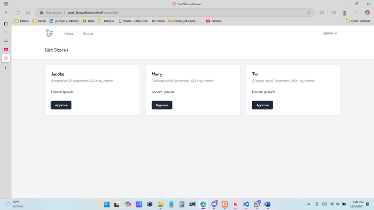
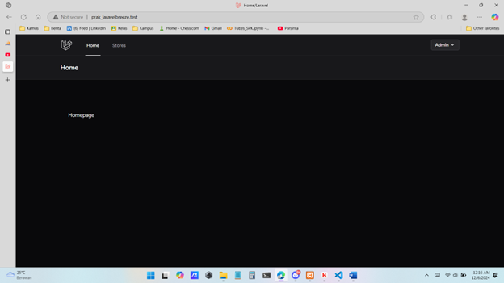
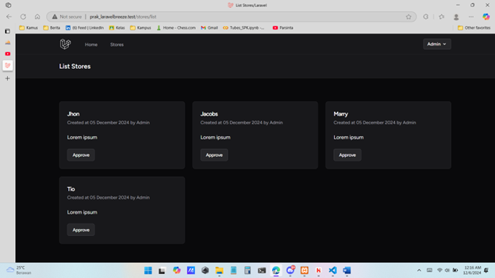
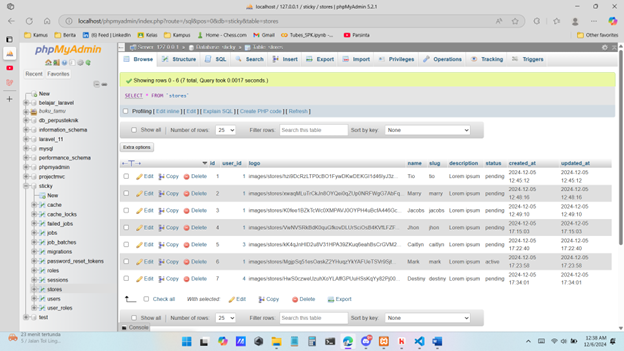
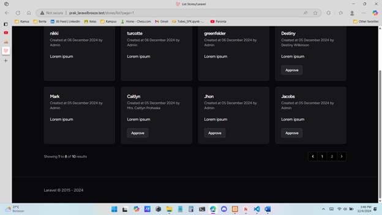
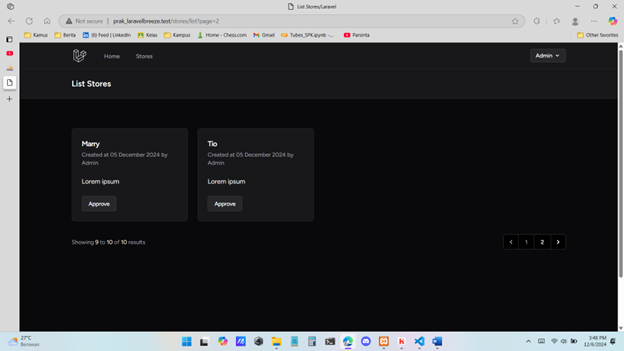
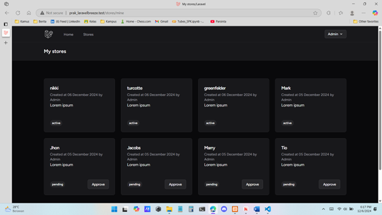
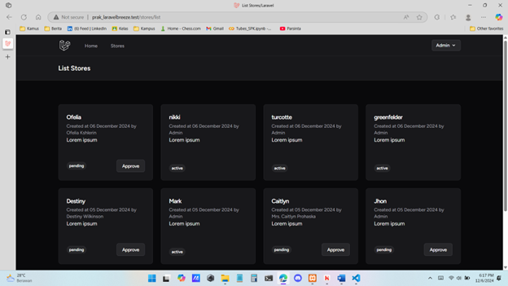
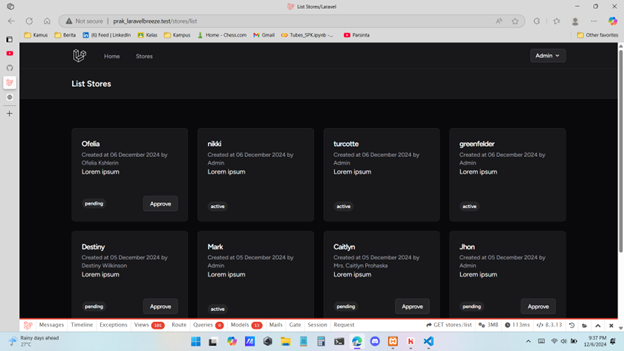
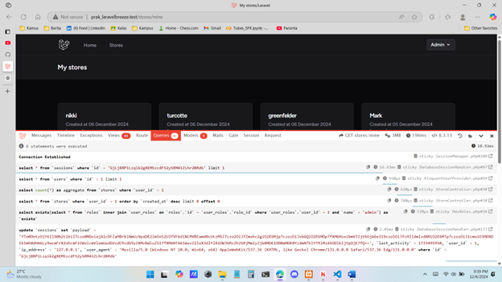

### Tugas 12

### Hasil Output

### Laravel 11/25 Custom Middleware Untuk Admin

### Laravel 11/26 Redesign dan Refactoring

### Laravel 11/27 Partner Auto Active

### Laravel 11/28 Pagination

### Laravel 11/29 Tampilan Toko dari User

### Laravel 11/30 Eager Loading dan Debugbar

## Kontribusi

Dibuat oleh Firja Rakha Adwittya.

## Lisensi

Projek ini dilisensikan di bawah [MIT License](LICENSE).