### Tugas 9

### Hasil Output

### 11/7 Facedes
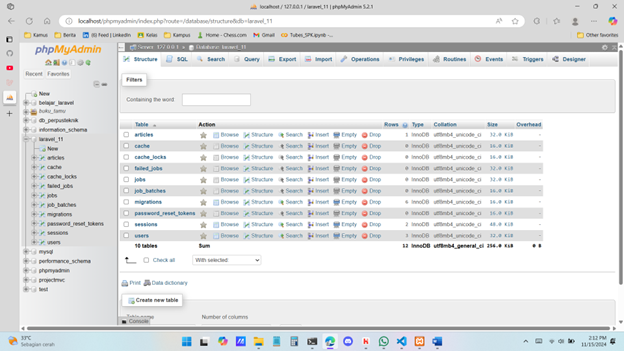
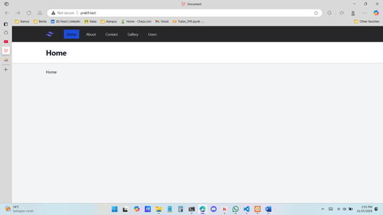
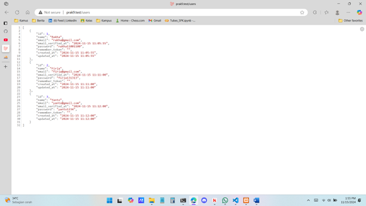

### 11/8 Model dan Fetching
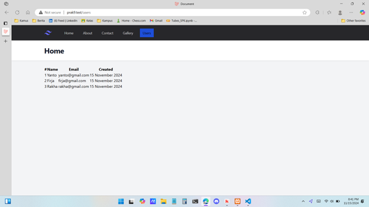

### 11/9 Kondisi Dalam Komponen
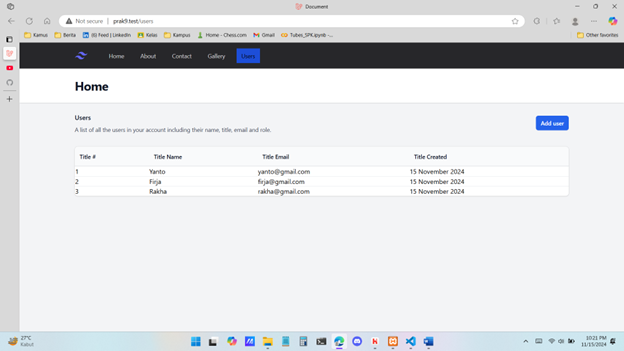
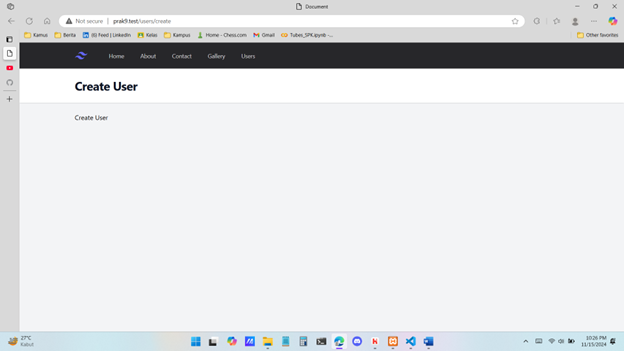

### 11/10 Fillable dan guarded
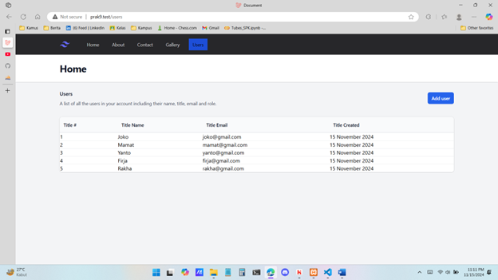
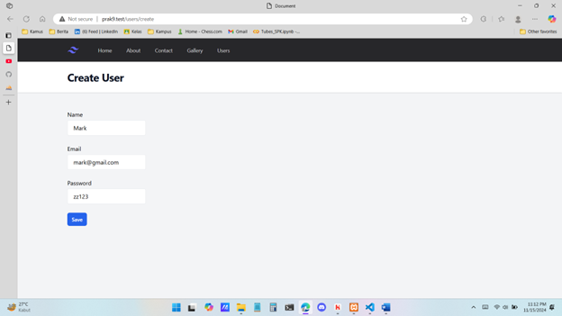
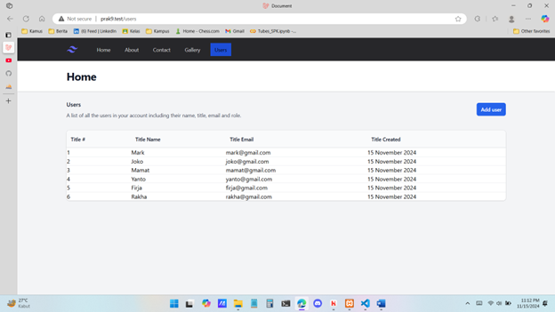

### 11/11 Validasi Data
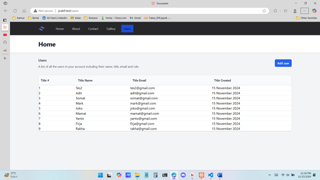
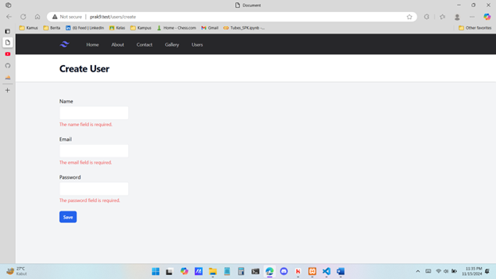

### 11/12 Route Wildcard
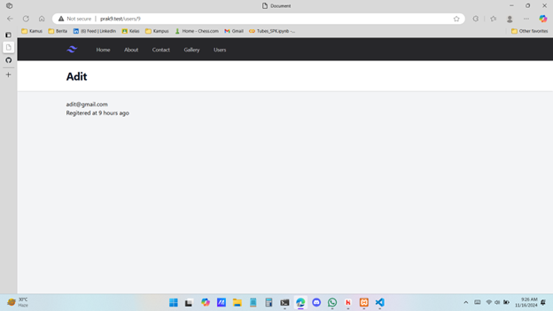

## Kontribusi

Dibuat oleh Firja Rakha Adwittya.

## Lisensi

Projek ini dilisensikan di bawah [MIT License](LICENSE).